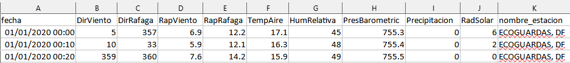
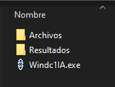
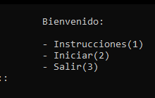
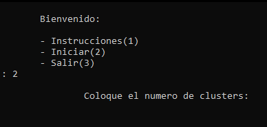
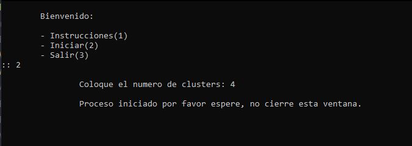
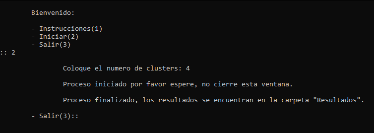
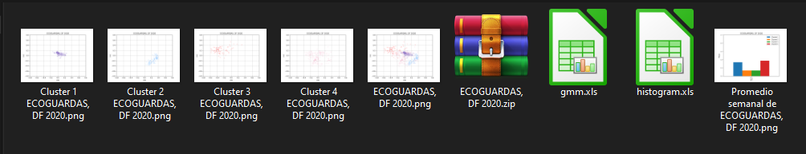

# WindC1IA
WindC1IA software generates automated classifications of the different wind states in a historical data set coming from  EMA, thus reducing the time of cleaning and sorting information from  EMA files. By studying large amounts of data,  the resulting classifications allow, example, to quickly review the wind potential of different areas. The WindC1IA software generates wind state graphs to speed up the analysis performed by experts in the area using the [`gmm`](https://scikit-learn.org/stable/modules/mixture.html) algorithm. 

# Libraries used and their version:

- **xlrd==1.2.0**
- **XlsxWriter==3.0.3**
- **numpy==1.22.2**
- **matplotlib==3.5.1**
- **sklearn==0.0**
- **pandas==1.4.1**
- **matplotlib==3.5.1**
- **openpyxl==3.0.10**

# Functions:

Two types of functions are available, cleaning and processing functionss.

## Cleaning functions:

- **cleanDataProcess:** Removes the folders generated from a previous analysis process when the program is started again.

- **cleanResults:** Removes the results from the Results folder when the process is restarted.

- **formats:** Allows the cleaning of the input data, removing the header, and the EMA's name, regardless if it is at the beginning or at the end, and fixes the date format. The generated files are saved in the newFormat1 folder.

- **mainFiles:** Creates the main folders for the program execution.

- **createFiles:** Creates the procedure folders at the start of the analysis.

- **months:** Arranges the order of execution of the files by month and separates each data by its corresponding month. The generated files are saved in the newFormat2 folder.

- **NaN:** Sets a whole row to NaN, if any data value in the row is NaN from the EMA's files.

- **ibxTrue:** Places the current index of each record in a different file.

- **idxTrue_clusters:** Gathers the index and the cluster type in a separate file.

- **results:** Generates a zip file by joining the files in the results folder.

- **info:** Collects operating system and data information.

- **oneFile:** Join all the files in the newFormat2 folder into a single XLS file, with the columns set, going from polar to Cartesian coordinates.

## Execution functions

- **gmm:** Uses the Gaussian Mixture Model to find wind states in the data, and plot these states using the direcction and speed axes.

- **gmmOne:** Generates one graph per cluster.

- **std:** Reads column two belonging to the classification of the idxTrue_clusters.XLS file and then generates six binary columns depending on the type of classification.

- **inputAc:** Prepares an input file, gathering the date and time of each record, as well as gathering the six binary variables depending on the classification type of the program std_prod.

- **histogram:** Converts the XLS file generated by input_ac.py to CSV file, to later develop the final histogram.

- **interface:** Defines the user interface.

- **main:**  Function that contains the order of execution of the process.

# Installation
The WindC1IA software has two versions, one for Windows and one for Linux. To run the Windows version, you only need to run the *WindC1IA.exe* program. For the Linux version, you must have [`Python 3.10.1`](https://www.python.org/downloads/)  or higher. I have installed the libraries needed are as follows.

- **pip install xlrd==1.2.0**
- **pip install XlsxWriter==3.0.3**
- **pip install numpy==1.22.2**
- **pip install matplotlib==3.5.1**
- **pip install sklearn==0.0**
- **pip install pandas==1.4.1**
- **pip install matplotlib==3.5.1**
- **pip install openpyxl==3.0.10**

Once the libraries are installed, the *WindC1IA.py* file can be executed. It is essential to clarify that for the Windows version, it is not necessary to have Python installed nor to have the libraries installed for the execution of the *WindC1IA.exe* executable. If we want to run the *WindC1IA.py* program in Windows, we will have to install [`Python 3.10.1`](https://www.python.org/downloads/) or higher and install the libraries mentioned above.

# Execution
To execute the Windc1A software, we will have to execute either the *WindC1IA.exe* or the *WindC1IA.py*. Once executed, we will get three options.

- **Instructions (1):** Choice option one, you will be provided with instructions for the execution and use of the program.

- **Start (2):** Choice option two, you will be asked for the number of clusters that must be taken into account for the program's execution and will start the process.

- **Exit (3):**  Option three will exit the program.

If it is the first time that the program is executed, the WindC1IA software will automatically create the folders Files and Results. To start the process, the files to be analyzed must be placed in the Files folder. The input files to be analyzed must be in the XLS format and must have the following order for the columns: *Date, WindDir, GustDir, WindRail, WindRap, GustRap, AirTemp, HumRelative, PresBarometric, Precipitation, RadSolar and the name of the station.* Note that the station name column can be at the beginning or at the end.

Example of the order of the columns:

  

At the end of the program execution, the results are stored in the Results folder, together with their .zip file.

# Example Execution
Inside the folder Example of results are the folders Files and Results. In the folder Files, there is the file *ECOGUARDAS_ene_2020*, a test file that will allow the running of the software. Inside the folder called Results, we have the graphs generated by the software, spreadsheets for analyzing these graphs, and a zip file that will store all the results previously mentioned.

Once executed, the folder's Files and Results will be generated automatically. The file *ECOGUARDAS_ene_2020* must be placed inside the folder Files. After that, the procedure must be started, and the final results will be in the folder Results.

If you need to run the WindC1IA.py program on Windows or Linux you will need to install Python and the libraries mentioned above, if you are using the Windows operating system you will be able to run the WindC1IA.exe program without installing Python and the libraries. It is possible that the Windows operating system detects the Windc1IA.exe program as a virus, to fix this you will need to disable your antivirus.

## Steps for program execution
- **Step 1:** Open the WindC1IA program. If this is the first time the program is opened, the folders Files and Results should be generated automatically.

  

- **Step 2:** Enter the Files folder and place the files you want to analyz.

  

- **Step 3:** Once the files to be analyzed have been placed in the Files folder, select option two from the menu and enter the number of clusters.

  

- **Step 4:** Once the cluster number has been entered, you will have to wait for the process to finish.

  

- **Step 5:** Once the process is finished we will be able to see the results in the Results folder.

  

- **Step 6:** The results are located in the folder named Results.

  

# Publications

This software has been used in the processing of information from the following publications:

Minutti-Martinez, C., Arellano-Vázquez, M., & Zamora-Machado, M. (2021, October). A Hybrid Model for the Prediction of Air Pollutants Concentration, Based on Statistical and Machine Learning Techniques. In Mexican International Conference on Artificial Intelligence (pp. 252-264). Springer, Cham.

Arellano-Vázquez, M., Minutti-Martinez, C., & Zamora-Machado, M. (2020, October). Automated characterization and prediction of wind conditions using gaussian mixtures. In Mexican International Conference on Artificial Intelligence (pp. 158-168). Springer, Cham

Magali, A. V., Marlene, Z. M., Robles, M., & Jaramillo, O. A. (2020, September). Favorable wind states in wind energy production at La Rumorosa I wind farm. In Journal of Physics: Conference Series (Vol. 1618, No. 6, p. 062071). IOP Publishing.
